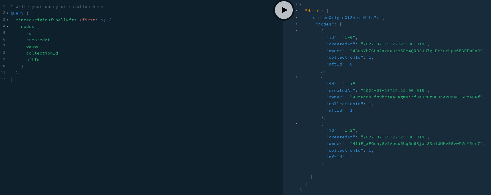

# Steps to Run Local Testnet & Test Indexer
Ensure that you have docker setup on your machine & change the configuration in `docker-compose.yml` if your ports are different.
## Configuration Setup
### Run a Local Thala Parachain Testnet
You can follow the steps [here](https://github.com/Phala-Network/khala-parachain/blob/main/polkadot-launch/README.md) to do the `polkadot-launch` & deploy your local testnet. **Note**: You can skip building the `polkadot` repo & instead install a compiled binary [here](https://github.com/paritytech/polkadot/releases) (Download the `polkadot` file ~`121 MB`) & copy the binary to the `polkadot-launch/bin/` folder in the `khala-parachain` repo.

After you build the `khala-parachain` then you can copy the `./target/release/khala-node` binary file to the `polkadot-launch/bin/` folder. Next you can launch your local testnet with the following command from the `./polkadot-launch` folder after running the `yarn install` command.
```shell
yarn start ./thala_dev_config.json
```

### Setup the Phala World SubQuery & Deploy Docker
Ensure all of your configurations are correct & make sure you have the correct genesis hash from your local testnet set in the `project.yml` file.
```shell
yarn install
yarn codegen
yarn build
yarn start:docker
```

### Scripts for Phala World Dummy Data to Index
Go to the [phala-world-dev](https://github.com/HashWarlock/phala-world-dev/scripts/phala-world) repo & run the scripts in the following order:
```shell
node ./initKhalaParachain.js
node ./startSpiritClaimProcess.js
node ./startRareOriginShellPurchase.js
node ./startWhitelistOriginShellPurchase.js
node ./startOriginShellPreorderProcess.js
```

## Query the Indexed Information
Go to https://localhost:3000 and start querying info in the Playground. Here is an example:
